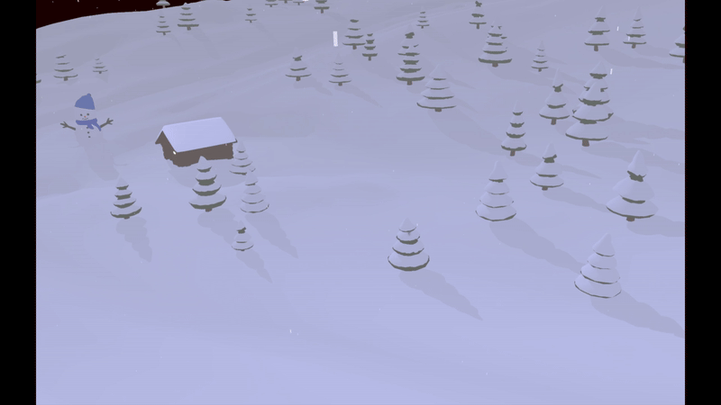

# OpenGL Rendering Engine

## Overview
This project is a simple **OpenGL-based rendering engine** that includes advanced **shaders, post-processing, camera movement, lighting effects, and a dynamic weather system**. 
The rendering engine is built using **GLFW, GLEW, and GLM**, and integrates various object models, sky rendering, fog, and snow effects.

## Features
- **Advanced Shaders:** Supports multiple shaders including fog, snow, sky, and combined post-processing.
- **Dynamic Weather System:** Storm mode with increased snowflakes, thunder, and lighting changes.
- **Post-Processing:** Implements bloom, which includes blurring, and other framebuffer-based effects, such as sepparating light areas into a sepparate texture for
them to be blurred.
- **Camera System:** Interactive camera movement with automated tour mode.
- **Lighting System:** Supports multiple light sources with realistic shading and ambient strength adjustments.
- **Shadow Mapping:** Real-time shadow computation done using the Z-Buffer technique.
- **Model Loading:** Imports 3D models from OBJ files with textures.

## Dependencies
- **OpenGL** (GLFW, GLEW)
- **GLM** (Mathematics Library)
- **stb_image** (Image loading)
- **Windows Audio (mmsystem.h)** (For sound effects)

## Project Structure
```
📁 OpenGL_RE
 ├── src/
 │   ├── main.cpp          # main application logic
 │   ├── Shader.hpp        # shader class for handling GLSL shaders
 │   ├── Camera.hpp        # camera class for movement and input handling
 │   ├── Model3D.hpp       # model loader for 3D objects
 │   ├── textures/         # texture files
 │   ├── objects/          # 3D object files (.obj)
 │   ├── shaders/          # vertex and fragment shaders
```

## Shaders & Rendering Techniques
- **Post-Processing:**
  - Scene rendering in a framebuffer for additional processing.
  - Bloom effect using multiple intermediary framebuffers.
  - The blur was realised via kernel blurring, not gaussian blurring.
  
  
  
---


- **Weather Effects:**
  - Snowflake system with movement and camera-relative updates.
  - Storm mode with increased snowflakes and thunder.
  
  
  
---


- **Shadow Mapping:**
  - Light-space transformations for real-time shadows.
  - Depth texture rendering for shadow calculations.
  
  
  
---


- **Transparency and material properties:**
  - In order to reflect realism, materials maintain real life properties.
  - This is done trough texturing with the respective specular and diffuse properties, as well as **alpha-blending**.
	
  

---

## Controls
| Key | Function |
|-----|----------|
| `W/S/A/D` | Move camera forward/backward/left/right |
| `SPACE/Z` | Move camera up/down |
| `J/L` | Adjust light angle |
| `T` | Toggle wireframe mode |
| `R` | Toggle automated camera tour |
| `P` | Toggle point rendering mode |
| `O` | Toggle lighting effects |
| `M` | Toggle storm mode |
| `ESC` | Exit application |

## Running the Project
1. **Ensure dependencies are installed**
   - OpenGL, GLFW, GLEW, and GLM must be available.
2. **Clone the repo**
	```sh 
	git clone https://github.com/Simi445/Event-Listing.git
	```
3. **Visual Studio**
   - Use VS in order to be able to run the project solution.
4. **Compile and run the executable**
   - The application initializes with a default scene and interactive controls.


---

### Contributors
- **CGIS** *(Original Codebase)*
- **Additional Contributors** *(List your team members if applicable)*

#### STB Image Contributors
This project also utilizes **stb_image.h**, a public domain image loader.

You can find it at: https://github.com/nothings/stb

---

Enjoy exploring the project! 🚀

